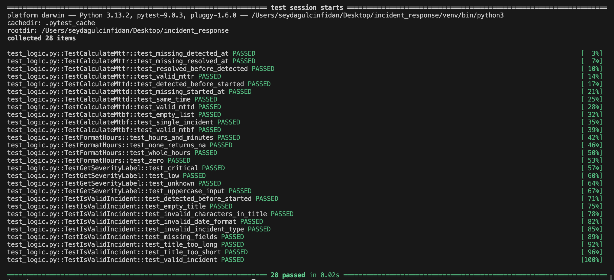

# Incident Response Tracker

**Student:** Şeyda Gülçin Fidan
**Student ID:** 230303058
**Course:** Software Engineering (SENG) Final Project

A web application built with Flask for tracking and managing cybersecurity incidents.

## What it does

This app lets security analysts log and manage security incidents. Each incident includes details like type, severity, status, and timestamps. The app also automatically calculates MTTD, MTTR and MTBF metrics, and keeps an activity log for every incident.

## Features

- Register, login and logout
- Add, edit, delete and view incidents
- Search incidents by title
- Filter incidents by status and severity
- Automatic MTTD, MTTR and MTBF calculations
- Activity log that tracks all changes to each incident

## How to run

1. Clone the repo
2. Create and activate a virtual environment:
```bash
python3 -m venv venv
source venv/bin/activate
```
3. Install Flask:
```bash
pip install flask
```
4. Run the app:
```bash
python3 app.py
```
5. Go to http://127.0.0.1:5000 in your browser

## Running tests

```bash
python3 -m pytest test_logic.py -v
```

## Test Results



## Database

Uses SQLite with 3 tables:
- `users` — stores registered users
- `incidents` — stores incident records linked to users
- `activity_log` — stores change history for each incident

## User Stories

**US1 – View Dashboard and Metrics**
As a user, I want to see a summary of my incidents (total, open, closed) when I log in, so that I can quickly track the status of my data.
- A logged-in user should only see the count of their own incidents (other users' data must not be included)
- Total, Open, and Closed incident counts must be displayed side by side on the screen
- When a new incident is added or an incident's status is updated, refreshing the page should update these counts accordingly

**US2 – Add a Time Validated Incident**
As a user, I want to add a new incident with start and detection times, so that I can keep records with accurate timestamps.
- Title, type, severity, started_at and detected_at fields are all required
- Detection time cannot be earlier than start time
- If the user enters an invalid time order, the system shows an error and does not save the record
- A successfully saved incident is automatically set to open and appears in the dashboard list

**US3 – View MTTD, MTTR and MTBF Metrics**
As a user, I want to open an incident and see MTTD, MTTR and MTBF already calculated so I don't have to do the math myself.
- MTTD shows the time between start and detection in hours and minutes
- MTTR shows the time between detection and resolution if the incident is closed
- If there is no resolution time, MTTR shows as N/A
- MTBF shows the average time between incidents. If there is only one incident, it shows as N/A

**US4 – Filter Incidents**
As a user, I want to filter my incidents by status and severity so I can find specific ones faster.
- Dashboard has two dropdowns, one for status and one for severity
- Filtering only shows my own incidents that match
- Selecting All shows everything

**US5 – Close and Update an Incident**
As a user, I want to edit an incident and close it with a resolution time so I can mark it as done.
- I can open the edit page for incidents I created
- I can set status to Closed and enter resolution time and action taken
- After saving, the Closed count on the dashboard goes up

**US6 – Track Incident Activity History**
As a user, I want to see a log of all changes made to an incident so that I can track what happened and when.
- When an incident is created, "Incident created" is automatically logged
- When an incident is edited, each changed field is recorded as a separate log entry
- Log entries are shown in chronological order on the incident detail page
- Users can only see activity logs for their own incidents

**US7 – Search Incidents by Title**
As a user, I want to search incidents by title so that I can quickly find a specific incident without scrolling through the whole list.
- I can type a keyword in the search box on the dashboard
- Only incidents whose title contains the keyword are shown
- Search works together with the status and severity filters
- If no incidents match, a "No incidents found" message is shown
